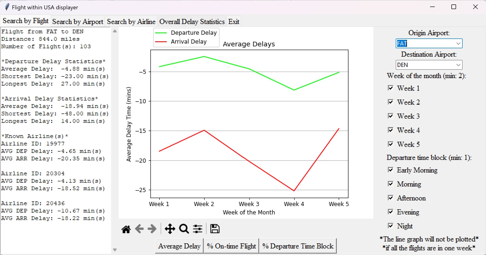
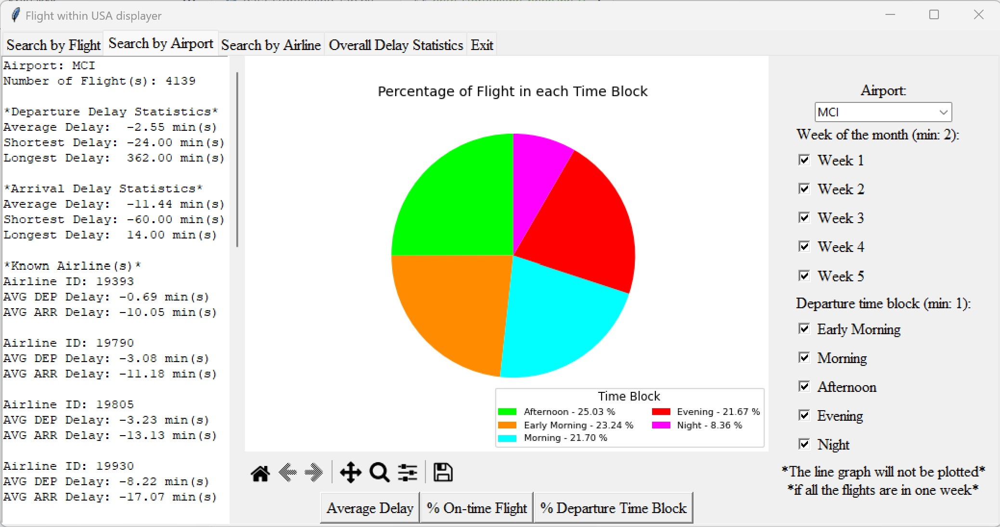
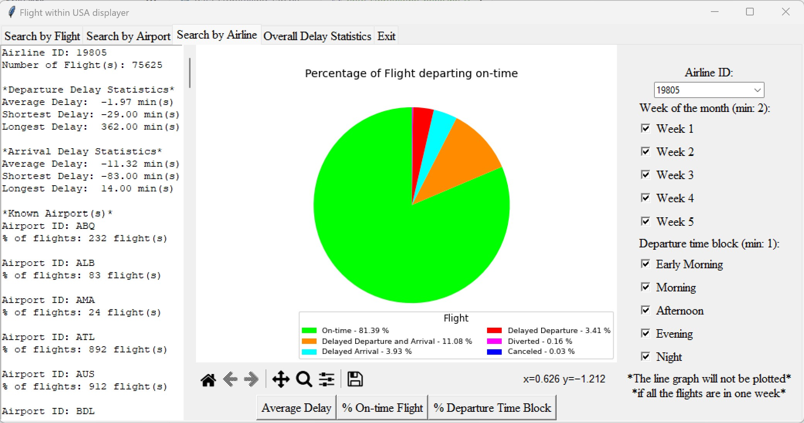
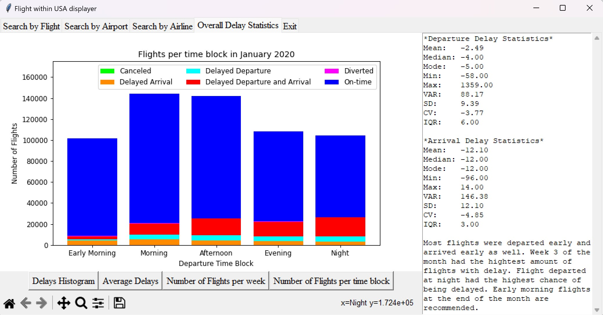

# Flight within USA Displayer
A program to compute and show delay information about US flights based on data from January 2020 (around 500k flights). The information includes departure delay, arrival delay, percentage of diverted flights, and percentage of canceled flights.
## Video
The explanation and demonstration video can be found [here](https://drive.google.com/file/d/1iILy_iSSIPH9-HLpxioSM9F0CEQYhbMK/view?usp=sharing)
## Screenshots
|Page|Screenshot|
|---|---|
|**Search by Flight**| |
|**Search by Airport**| |
|**Search by Flight**| |
|**Overall Delay Statistics (Data Storytelling)**| 

## Requirements

Requires Python 3.8 or newer.  Required Python packages are listed in [requirements.txt](./requirements.txt).

## How to install
### Clone this repository or download it as zip and extract it
```
git clone https://github.com/BioB3/Flight-within-USA-Displayer.git
```
### Navigate to the project directory
```
cd Flight-within-USA-Displayer
# Flight-within-USA-Displayer-1.0 if download from releases
```
### Install all the packages required by the program
```
pip install -r requirements.txt
```
#### See [Installation](https://github.com/BioB3/Flight-within-USA-Displayer/wiki/Installation-Instructions) for more information
## How to run
### Start a virtual environment (optional)
1\) Create a virtual environment
```
python -m venv env
```
2\) Activate the virtual environment</br>
```
# Activate the virtual env on Linux and MacOS
source env/bin/activate
# Or, on MS Windows:
env\Scripts\activate
```
### Start the program
The program need a few seconds before displaying UI
```
python main.py
```
### Stop the program
Click the exit tab in the UI, then exit the virtualenv using:
```
deactivate
```
## Project Documents
All project-related documents are in the [Project Wiki](https://github.com/BioB3/Flight-within-USA-Displayer/wiki)\
[Project Proposal](https://docs.google.com/document/d/1-VZk-_8u3e_cACW_JfGBeHL-G4JEAu5ZTDW7uUpkOSk/edit#heading=h.brkgjcw3i7fl)\
[Development Plan](https://github.com/BioB3/Flight-within-USA-Displayer/wiki/Development-Plan)\
[UML Diagrams](https://github.com/BioB3/Flight-within-USA-Displayer/wiki/Design-Documents-and-UML-Diagrams)\
[Sources of data](https://github.com/BioB3/Flight-within-USA-Displayer/wiki/Sources-of-data)
